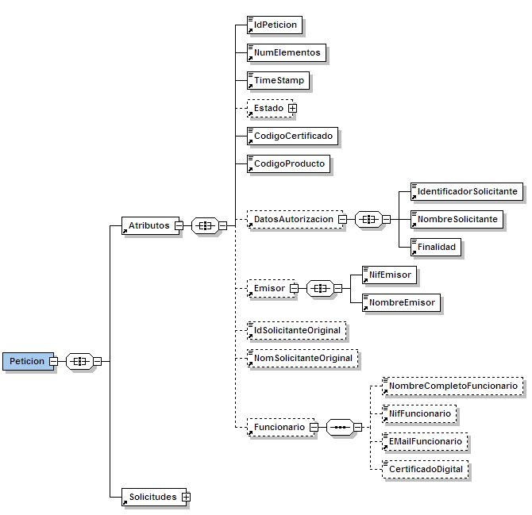
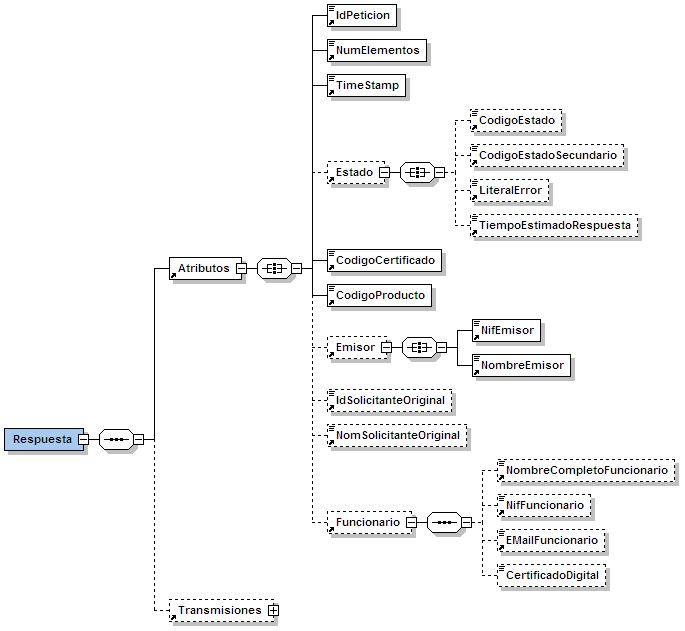

# Especificació de missatgeria pel consum de productes – Plataforma de Col·laboració Interadministrativa (PCI)

# Índex
- [Introducció](#introducció)
- [Requeriments d’accés als serveis](#requeriments-daccés-als-serveis)
	* [Sol·licitud d’autorització](#sollicitud-dautorització)
	* [Requeriments per accés via frontal webservice](#requeriments-per-accés-via-frontal-webservice)
		- [Política de seguretat](#política-de-seguretat)
		- [URLs d’accés de producció](#urls-daccés-de-producció)
		- [URLs d’accés de preproducció](#urls-daccés-de-preproducció)
- [Frontals d’accés a la plataforma](#frontals-daccés-a-la-plataforma)
	* [Tipus de comunicació](#tipus-de-comunicació)
		- [Frontal webservice síncron](#frontal-webservice-síncron)
		- [Frontal webservice asíncron](#frontal-webservice-asíncron)
	* [Tipus de missatges i operacions](#tipus-de-missatges-i-operacions)
		- [Petició síncrona i asíncrona](#petició-síncrona-i-asíncrona)
		- [Confirmació petició](#confirmació-petició)
		- [Sol·licitud de resposta per a una petició](#sollicitud-de-resposta-per-a-una-petició)
		- [Resposta a una petició](#resposta-a-una-petició)
- [Detall de la missatgeria](#detall-de-la-missatgeria)
	* [Petició síncrona / asíncrona](#petició-síncrona--asíncrona)
		- [Estructura](#estructura)
		- [Descripció de camps](#descripció-de-camps)
		- [Exemple de missatge](#exemple-de-missatge)
	* [Confirmació petició](#confirmació-petició-1)
		- [Estructura](#estructura-1)
		- [Descripció de camps](#descripció-de-camps-1)
		- [Exemple de missatge](#exemple-de-missatge-1)
	* [Sol·licitud resposta](#sollicitud-resposta)
		- [Estructura](#estructura-2)
		- [Descripció de camps](#descripció-de-camps-2)
		- [Exemple de missatge](#exemple-de-missatge-2)
	* [Resposta](#resposta)
		- [Estructura](#estructura-3)
		- [Descripció de camps](#descripció-de-camps-3)
		- [Exemple de missatge](#exemple-de-missatge-3)
	* [Extensions de missatgeria](#extensions-de-missatgeria)
		- [Estructura](#estructura-4)
		- [Descripció de camps](#descripció-de-camps-4)
		- [Exemple de missatge](#exemple-de-missatge-4)
- [Política de seguretat](#política-de-seguretat-1)
	* [Autenticació](#autenticació)
	* [Autorització](#autorització)

# Introducció

Aquest document detalla la missatgeria genèrica establerta pel consum de productes de la *Plataforma de  Col·laboració  Interadministrativa*  del  CAOC  (en  endavant  PCI)  i  presenta  els  requeriments  i procediments que cal realitzar a l’hora de consumir-los. 

Aquest document complementa la documentació específica de qualsevol producte publicat a la PCI. 

# Requeriments d’accés als serveis

A  continuació  s’indiquen  els  requeriments  necessaris  per  tal  de  poder  consumir  els  productes d’interoperabilitat. 

## Sol·licitud d’autorització

- Sol·licitar al CAOC l’autorització per accedir al producte i modalitat de consum que es desitja en nom de l’organisme requeridor del qual som responsables i per a les finalitats que motiven l’accés al producte. 

Un cop l’autorització es faci efectiva, s’informarà a l’organisme requeridor la següent informació d’autorització que caldrà conèixer a l’hora d’invocar serveis d’interoperabilitat i que constarà al catàleg de serveis de la PCI: 

- Codi d’organisme requeridor 
- Codi/s de producte 
- Codi/s de modalitat de consum 
- Codi/s de finalitat 
- Sol·licitar al CAOC l’autorització del certificat CDA amb el que es signaran les peticions dirigides a la PCI via els frontals webservice. 

## Requeriments per accés via frontal webservice

### Política de seguretat

Tota petició destinada a la PCI via un frontal webservice està subjecte a la política de seguretat que es detalla en l’apartat [*Política de seguretat*](#política-de-seguretat-1) d’aquest document. 

### URLs d’accés de producció

#### Clúster d’interoperabilitat (IOP)

|*Frontal síncron* |https://serveis3.iop.aoc.cat/siri-proxy/services/Sincron |
| - | - |
|*Frontal asíncron* |https://serveis3.iop.aoc.cat/siri-proxy/services/Asincron |
|*Frontal asíncron-resposta* |https://serveis3.iop.aoc.cat/siri-proxy/services/AsincronResposta |

|*WSDL frontal síncron* |https://serveis3.iop.aoc.cat/siri-proxy/services/Sincron?wsdl |
| - | - |
|*WSDL frontal asíncron* |https://serveis3.iop.aoc.cat/siri-proxy/services/Asincron?wsdl |
|*WSDL frontal asíncron-resposta* |https://serveis3.iop.aoc.cat/siri-proxy/services/AsincronResposta?wsdl |

#### Clúster d’aplicacions (APP)

|*Frontal síncron* |https://serveis3.app.aoc.cat/siri-proxy/services/Sincron |
| - | - |
|*Frontal asíncron* |https://serveis3.app.aoc.cat/siri-proxy/services/Asincron |
|*Frontal asíncron-resposta* |https://serveis3.app.aoc.cat/siri-proxy/services/AsincronResposta |

|*WSDL frontal síncron* |https://serveis3.app.aoc.cat/siri-proxy/services/Sincron?wsdl |
| - | - |
|*WSDL frontal asíncron* |https://serveis3.app.aoc.cat/siri-proxy/services/Asincron?wsdl |
|*WSDL frontal asíncron-resposta* |https://serveis3.app.aoc.cat/siri-proxy/services/AsincronResposta?wsdl |

#### Clúster d’eNOTUM (NT)

|*Frontal síncron* |https://serveis3.nt.aoc.cat/siri-proxy/services/Sincron |
| - | - |
|*Frontal asíncron* |https://serveis3.nt.aoc.cat/siri-proxy/services/Asincron |
|*Frontal asíncron-resposta* |https://serveis3.nt.aoc.cat/siri-proxy/services/AsincronResposta |

|*WSDL frontal síncron* |https://serveis3.nt.aoc.cat/siri-proxy/services/Sincron?wsdl |
| - | - |
|*WSDL frontal asíncron* |https://serveis3.nt.aoc.cat/siri-proxy/services/Asincron?wsdl |
|*WSDL frontal asíncron-resposta* |https://serveis3.nt.aoc.cat/siri-proxy/services/AsincronResposta?wsdl |

### URLs d’accés de preproducció

#### Clúster d’interoperabilitat (IOP)

|*Frontal síncron* |https://serveis3-pre.iop.aoc.cat/siri-proxy/services/Sincron |
| - | - |
|*Frontal asíncron* |https://serveis3-pre.iop.aoc.cat/siri-proxy/services/Asincron |
|*Frontal asíncron-resposta* |https://serveis3-pre.iop.aoc.cat/siri-proxy/services/AsincronResposta |

|*WSDL frontal síncron* |https://serveis3-pre.iop.aoc.cat/siri-proxy/services/Sincron?wsdl |
| - | - |
|*WSDL frontal asíncron* |https://serveis3-pre.iop.aoc.cat/siri-proxy/services/Asincron?wsdl |
|*WSDL frontal asíncron-resposta* |https://serveis3-pre.iop.aoc.cat/siri-proxy/services/AsincronResposta?wsdl |

#### Clúster d’aplicacions (APP)

|*Frontal síncron* |https://serveis3-pre.app.aoc.cat/siri-proxy/services/Sincron |
| - | - |
|*Frontal asíncron* |https://serveis3-pre.app.aoc.cat/siri-proxy/services/Asincron |
|*Frontal asíncron-resposta* |https://serveis3-pre.app.aoc.cat/siri-proxy/services/AsincronResposta |

|*WSDL frontal síncron* |https://serveis3-pre.app.aoc.cat/siri-proxy/services/Sincron?wsdl |
| - | - |
|*WSDL frontal asíncron* |https://serveis3-pre.app.aoc.cat/siri-proxy/services/Asincron?wsdl |
|*WSDL frontal asíncron-resposta* |https://serveis3-pre.app.aoc.cat/siri-proxy/services/AsincronResposta?wsdl |

#### Clúster d’eNOTUM (NT)

|*Frontal síncron* |https://serveis3-pre.nt.aoc.cat/siri-proxy/services/Sincron |
| - | - |
|*Frontal asíncron* |https://serveis3-pre.nt.aoc.cat/siri-proxy/services/Asincron |
|*Frontal asíncron-resposta* |https://serveis3-pre.nt.aoc.cat/siri-proxy/services/AsincronResposta |

|*WSDL frontal síncron* |https://serveis3-pre.nt.aoc.cat/siri-proxy/services/Sincron?wsdl |
| - | - |
|*WSDL frontal asíncron* |https://serveis3-pre.nt.aoc.cat/siri-proxy/services/Asincron?wsdl |
|*WSDL frontal asíncron-resposta* |https://serveis3-pre.nt.aoc.cat/siri-proxy/services/AsincronResposta?wsdl |

# Frontals d’accés a la plataforma

## Tipus de comunicació

Existeixen diferents mecanismes d’invocació a la plataforma PCI: frontal webservice síncron i frontal webservice asíncron. 

### Frontal webservice síncron

Mitjançant  el  frontal  webservice  síncron,  l’enviament  de  la  petició  i  la  resolució  del  mateix s’estableixen en una única comunicació (petició-resposta). 

En aquesta comunicació es defineixen dos missatges: *Peticion* i *Respuesta*. 


### Frontal webservice asíncron

Mitjançant el frontal webservice asíncron, l’enviament de la petició rep com a resposta la previsió d’entrega  de  la  informació  demanada  o  TER  (temps  estimat  de  resposta).  Així,  l’entrega  de  la resposta es realitza en una segona comunicació.  

En  aquesta  comunicació  es  defineixen  quatre  missatges:  *Peticion*,  *ConfirmacionPeticion*, *SolicitudRespuesta* i *Respuesta*. 


## Tipus de missatges i operacions

A continuació es descriuen les diferents operacions així com la missatgeria associada.  

Remarcar  que  dins  de  l’esquema  de  *Peticion*  i  *Respuesta*  existeix  un  node  de  tipus  lliure  *(any*) anomenat *DatosEspecificos* preparat per contenir la informació específica de petició i de resposta dels diferents productes d’interoperabilitat i que es detalla als documents de servei de cada producte. 

||*Missatge entrada (Organisme requeridor* à *PCI)* |<p>*Missatge sortida* </p><p>*(PCI* à *Organisme requeridor)* </p>|
| :- | :- | - |
|*Frontal WS síncron* |peticion.xsd |respuesta.xsd |
|*Frontal WS asíncron* |peticion.xsd |confirmacion-peticion.xsd |
|*Frontal WS asíncron-resposta* |solicitud-respuesta |respuesta.xsd |

<p align="center"><b>Taula 1 - Schemes associats a cada comunicación</b></p>

### Petició síncrona i asíncrona

|*Característica* |*Descripció* |
| - | - |
|Sentit |Organisme requeridor à PCI |
|Contingut |Aquest  missatge  conté  la  informació  necessària  per  identificar  el  producte  a consumir (organisme emissor, producte i modalitat de consum) i les dades del requeridor (organisme requeridor, finalitat per la qual està autoritzat el consum, funcionari que sol·licita la informació, etc.). |
||<p>Una petició suporta un nombre variable de sol·licituds de consum d’un producte i  modalitat  de  consum  determinada.  A  les  sol·licituds  s’indica  la  informació específica requerida pel consum del producte / modalitat. </p><p>Si usem el frontal síncron estem demanat que el sistema contesti la nostra petició amb els resultats de la mateixa.  </p><p>Si usem el frontal asíncron estem demanant al sistema que ens respongui amb una confirmació de petició i el temps estimat de resposta. </p>|
|Frontals PCI |Webservice síncron i webservice asíncron. |

### Confirmació petició

|*Característica* |*Descripció* |
| - | - |
|Sentit |PCI à Organisme requeridor |
|Contingut |En  aquest  missatge  PCI  indica  a  l’organisme  requeridor  el  temps  estimat  de resposta a la seva petició. |
|Frontals PCI |Webservice asíncron. |

### Sol·licitud de resposta per a una petició

|*Característica* |*Descripció* |
| - | - |
|Sentit |Organisme requeridor à PCI |
|Contingut |<p>El missatge conté tota la informació necessària per identificar la petició original. Es fa ús d’aquest missatge per demanar a la plataforma la entrega de un resultat. </p><p>El missatge no inclou totes les respostes a les sol·licituds del missatge fins que tota la petició no es considera finalitzada. </p>|
|Frontals PCI |Webservice asíncron. |

### Resposta a una petició

|*Característica* |*Descripció* |
| - | - |
|Sentit |PCI  à Organisme requeridor |
|Contingut |<p>Aquest missatge conté la informació de resposta a la petició generada. </p><p>A les dades específiques de les transmisions es dóna resposta a les sol·licituds realitzades. </p>|
|Frontals PCI |Webservice síncron i webservice asíncron. |

# Detall de la missatgeria

## Petició síncrona / asíncrona

El missatge corresponent a una petició es divideix en dos grans blocs: 

- *Atributos*: conté l’identificador de la petició, la informació que indica el producte i modalitat de consum a la que accedim així com en nom de quin òrgan i per a quina finalitat.  
- *Solicitudes*:  conté  les  dades  de  les  diferents  sol·licituds  de  modalitats  de  consum  que  es consulten.  Sempre  cal  replicar  les  dades  de  producte,  modalitat,  òrgan  i  finalitat  en  cada sol·licitud.  

### Estructura




En l’schema anterior es ressalta l’element `<DatosEspecificos>`, on s’informa el missatge específic del producte i modalitat de consum a la que es vol accedir. 

### Descripció de camps

|**Ubicació** |**Nom** |**Tipus** |**Req** |**Descripció** |
| - | - | - | - | - |
|Peticion |Atributos |BLOC |Si |Bloc únic. Conté les dades de  control,  relatives  a tota  la  petició  (n sol·licituds).  |
|Peticion/Atributos |IdPeticion |String |Si |Identificador de petició. |
|Peticion/Atributos |NumElementos |String |Si |<p>Nombre  de  elements  de  la petició. </p><p>500 com a màxim en cas de peticions asíncrones. </p>|
|Peticion/Atributos |TimeStamp |String |Si |<p>Data i hora del enviament del missatge. Format:  </p><p>AAAA-MM- DDThh:mm:ss.mmm±hh:mm </p>|
|Peticion/Atributos |CodigoCertificado |String |Si |El codi del certificat al que  estem  accedint (Modalitat  de  Consum).  El mateix valor que va en la part de dades Genèriques de la sol·licitud. El defineix cada emissor. No pot haver- hi dos iguals. |
|Peticion/Atributos |CodigoProducto |String |Si |El codi de producte al que estem accedint. El defineix cada emissor. No pot haver- hi dos iguals.  |
|Peticion/Atributos |DatosAutoritzacion |BLOC |No |Bloc  únic  que  engloba  la informació  d’autorització del  missatge.  Bloc obligatori  per  superar l’autorització. |
|Peticion/Atributos/DatosAutoritzac ion |IdentificadorSolicitante |String |Si |Codi  identificador  de l’organisme requeridor. |
|Peticion/Atributos/DatosAutoritzac ion |NombreSolicitante |String |Si |Nom  de  l’organisme requeridor. |
|Peticion/Atributos/DatosAutoritzac ion |Finalidad  |String |Si  |Finalitat  associada  al consum  del  producte  / modalitat de consum  de la petició. |
|Peticion/Atributos |Emisor |BLOC |No |Bloc únic. Conté dades del emissor del servei. |
|Peticion/Atributos/Emisor  |NifEmisor |String |Si |Identificador (NIF/CIF) del Emissor del servei. |
|Peticion/Atributos/Emisor  |NombreEmisor |String |Si |Nom  o  raó  social  del emissor del servei. |
|Peticion/Atributos/ |Funcionario |BLOC |No |Bloc únic. Conté dades del funcionari  que  ha  generat la petició. |
|Peticion/Atributos/Funcionario |NombreCompletoFuncionario |String |No |Nom complert del Funcionari que ha generat la petició. </br>**En el cas de serveis d'Interoperabitalitat(VO), per donar compliment a la normativa aplicable, sempre s'ha d'emplenar i les dades que s'informin cal que siguin reals** |
|Peticion/Atributos/Funcionario |NifFuncionario |String |No |Identificador  (NIF)  del funcionari.</br>**En el cas de serveis d'Interoperabitalitat(VO), per donar compliment a la normativa aplicable, sempre s'ha d'emplenar i les dades que s'informin cal que siguin reals** |
|Peticion/Atributos/Funcionario |EMailFuncionario |String |No |Adreça  de  correu  del funcionari.|
|Peticion/Atributos/Funcionario |CertificadoDigital |Base64Binary |No |Certificat  Digital  del funcionari |
|Peticion |Solicitudes |BLOC |Si |Bloc  únic  que  engloba  la llista  de  sol·licituds  de transmissió que s’envien. |
|Peticion/Solitudes  |SolicitudTransmision |BLOC |Si |Bloc que es repeteix de 1 a n  cops.  Conté  les  dades relatives a una sol·licitud de transmissió. |
|Peticion/Solitudes/SolicitudTransm ision |DatosGenericos |BLOC |Si |Bloc únic. Conté les dades genèriques  sobre  una transmissió. |
|Peticion/Solitudes/SolicitudTransm ision/DatosGenericos |Emisor |BLOC |Si |Bloc únic. Conté dades del emisor del servei. |
|Peticion/Solitudes/SolicitudTransm ision/DatosGenericos/Emisor |NifEmisor |String |Si |Identificador  (NIF)  del Emissor. |
|Peticion/Solitudes/SolicitudTransm ision/DatosGenericos/Emisor  |NombreEmisor |String |Si |Nom  del  emissor  o  raó social. |
|Peticion/Solitudes /SolicitudTransmision/DatosGeneric os |Solicitante |BLOC |Si |Bloc únic. Conté dades del sol·licitant  de  la transacció. |
|Peticion/Solitudes/SolicitudTransm ision/DatosGenericos/Solicitante |IdentificadorSolicitante |String |Si |Codi  identificador  del requeridor. |
|Peticion/Solitudes/SolicitudTransm ision/DatosGenericos/Solicitante |NombreSolicitante |String |Si |Nom o raó social. |
|Peticion/Solitudes/SolicitudTransm ision/DatosGenericos/Solicitante |Finalidad  |String |Si  |Finalitat  associada  al consum  del  producte  la petició. |
|Peticion/Solitudes/SolicitudTransm ision/DatosGenericos/Solicitante |Procedimiento  |String |Si  |Autorització per procediment SIA només per Via Oberta |
|Peticion/Solitudes/SolicitudTransm ision/DatosGenericos/Solicitante |Consentimiento |String |Si |Valors admesos: </p><p>- **Sí** -> Es seleccionarà "SÍ" en els casos en què una llei exigeixi a l'administració l'obtenció del consentiment exprés de la ciutadania per accedir a les seves dades. En aquests casos, quan es tramiti la sol·licitud d’autorització per tipus de procediment als serveis de Via Oberta, caldrà adjuntar el formulari de l’ens on consti una clàusula on se sol·liciti el consentiment exprés a la consulta. </p><p>- **Llei**  -> Es seleccionarà “Llei” en els casos en què una llei indiqui que no s'ha de requerir el consentiment de la persona interessada o bé no deixi cabuda al dret d’oposició.</p>|
|Peticion/Solitudes/SolicitudTransm ision/DatosGenericos/Solicitante |Funcionario |BLOC |No |Bloc únic. Conté dades del funcionari  que  ha  generat la sol·licitud. |
|Peticion/Solitudes/SolicitudTransm ision/DatosGenericos/Solicitante/F uncionario |NombreCompletoFuncionario |String |No |Nom complert del Funcionari que ha generat la petició. |
|Peticion/Solitudes/SolicitudTransm ision/DatosGenericos/Solicitante/F uncionario |NifFuncionario |String |No |Identificador  (NIF)  del funcionari. |
|Peticion/Solitudes/SolicitudTransm ision/DatosGenericos/Solicitante/F uncionario |EMailFuncionario |String |No |Adreça  de  correu  del funcionari. |
|Peticion/Solitudes/SolicitudTransm ision/DatosGenericos/Solicitante/F uncionario |CertificadoDigital |Base64Binary |No |Certificat  Digital  del Funcionari |
|Peticion/Solitudes/SolicitudTransm ision/DatosGenericos  |Transmision |BLOC |Si |Bloc únic. Conté les dades del certificat que es vol demanar. |
|Peticion/Solitudes/SolicitudTransm ision/DatosGenericos/Transmision |CodigoCertificado |String |Si |El codi del certificat al que  estem  accedint (Modalitat  de  Consum).  El mateix valor que va en la part de dades Genèriques de la sol·licitud. El defineix cada emissor. No pot haver- hi dos iguals. |
|Peticion/Solitudes/SolicitudTransm ision/DatosGenericos/Transmision |IdSolicitud |String |Si |Codi  de  sol·licitud,  únic pel organisme sol·licitant. |
|Peticion/Solitudes/SolicitudTransm ision/DatosGenericos/Transmision |IdTransmision |String |no |<p>Codi  genereat  per l’organisme  emisor.  Ha  de ser  únic  per  totes  les transmissions generades per l’organisme. </p><p>Normalment  s’informa  el número d’expedient associat a la sol·licitud. </p>|
|Peticion/Solitudes/SolicitudTransm ision/DatosGenericos/Transmision |FechaGeneracion |String |Si |Data de la generació de la transmissió.  Format:  AAAA- MM-DD |
|Peticion/Solitudes/SolicitudTransm ision/DatosGenericos |Ficheros |BLOC |No |Bloc  únic.  Conté referències  a  fitxers adjunts a la petició. |
|Peticion/Solitudes/SolicitudTransm ision/DatosGenericos/Ficheros |Fichero |BLOC |Si |Bloc  múltiple.  Conté referència a fitxer adjunt a la petició. |
|Peticion/Solitudes/SolicitudTransm ision/DatosGenericos/Ficheros/Fich ero |NombreFichero |String |No |Nom del fitxer adjunt. |
|Peticion/Solitudes/SolicitudTransm ision/DatosGenericos/Ficheros/Fich ero |RutaFichero |String |Si |Ruta al fitxer adjunt. |
|Peticion/Solitudes/SolicitudTransm ision/DatosGenericos/Ficheros/Fich ero |URLDescarga |String |Si |URL  de  descàrrega  del fitxer adjunt. |
|Peticion/Solitudes/SolicitudTransm ision/DatosGenericos/Ficheros/Fich ero |Contenido |Base64Binary |Si |Referència XOP al contingut de  l’adjunt  en transferència MTOM. |
|Peticion/Solitudes/SolicitudTransm ision/DatosGenericos/Ficheros/Fich ero |Id |String |Si |Identificador  del  fitxer adjunt. |
|Peticion/Solitudes/SolicitudTransm ision/DatosGenericos/Ficheros/Fich ero |Hash |Base64Binary |No |Hash del fitxer adjunt. |
|Peticion/Solitudes/SolicitudTransm ision/DatosGenericos/Ficheros/Fich ero |Firma |Base64Binary |No |Signatura  detached  del fitxer adjunt. |
|Peticion/Solitudes/SolicitudTransm ision/DatosGenericos/Ficheros/Fich ero |Via |String |No |Entrada / Salida. |
|Peticion/Solitudes/SolicitudTransm ision |DatosEspecificos |BLOC |No |Bloc únic. Conté les dades de  transmissió  que  es sol·licita  al  organisme emissor  i  que  té  relació específica  amb  el certificat  (modalitat  de consum)  que  s’està demanant.  |

### Exemple de missatge

```xml
<Peticion xmlns="http://gencat.net/scsp/esquemes/peticion">
	<Atributos> 
		<IdPeticion>ID_PETICIO_SINC</IdPeticion> 
		<NumElementos>1</NumElementos> 
		<TimeStamp>2007-04-18 17:35:02.454</TimeStamp> 
		<Estado> 
			<CodigoEstado/>
			<CodigoEstadoSecundario/>
			<LiteralError/>
			<TiempoEstimadoRespuesta>0</TiempoEstimadoRespuesta> 
		</Estado> 
		<CodigoCertificado>RESIDENT</CodigoCertificado>
		<CodigoProducto>PADRO</CodigoProducto>
		<DatosAutorizacion> 
			<IdentificadorSolicitante>CAOC</IdentificadorSolicitante>
			<NombreSolicitante>CAOC</NombreSolicitante>
			<Finalidad>FINALITAT</Finalidad> 
		</DatosAutorizacion>
		<Emisor> 
			<NifEmisor>Q0801175A</NifEmisor>
			<NombreEmisor>CAOC</NombreEmisor> 
		</Emisor>
		<IdSolicitanteOriginal>MAP</IdSolicitanteOriginal>
		<NomSolicitanteOriginal>MAP</NomSolicitanteOriginal> 
		<Funcionario> 
			<NombreCompletoFuncionario>FUNCIONARIO</NombreCompletoFuncionario>
			<NifFuncionario>NIF</NifFuncionario> 
			<EMailFuncionario/> 
		</Funcionario> 
	</Atributos>
	<Solicitudes> 
		<SolicitudTransmision>
			<DatosGenericos> 
				<Emisor> 
					<NifEmisor>Q0801175A</NifEmisor> 
					<NombreEmisor>CAOC</NombreEmisor> 
				</Emisor> 
				<Solicitante> 
					<IdentificadorSolicitante>CAOC</IdentificadorSolicitante>
					<NombreSolicitante>CAOC</NombreSolicitante>
					<Finalidad>FINALITAT</Finalidad> 
					<Consentimiento>Si</Consentimiento> 
					<Funcionario> 
						<NombreCompletoFuncionario>FUNCIONARIO</NombreCompletoFuncionario>
						<NifFuncionario>NIF</NifFuncionario> 
						<EMailFuncionario/> 
					</Funcionario> 
				</Solicitante> 
				<Titular> 
					<TipoDocumentacion>NIF</TipoDocumentacion>
					<Documentacion>99999999R</Documentacion>
					<NombreCompleto>Pere Parra Polser</NombreCompleto>
					<Nombre>Pere</Nombre>
					<Apellido1>Parra</Apellido1>
					<Apellido2>Polser</Apellido2> 
				</Titular> 
				<Transmision> 
					<CodigoCertificado>RESIDENT</CodigoCertificado> 
					<IdSolicitud>AOC00000000100373</IdSolicitud> 
					<IdTransmision>EXPEDIENT</IdTransmision> 
					<FechaGeneracion>18042007</FechaGeneracion>
				</Transmision> 
			</DatosGenericos> 
			<DatosEspecificos> 
				<ns1:peticionResidente xmlns:ns1="http://www.aocat.net/padro">
					<ns1:numExpediente>NUM_EXP</ns1:numExpediente> 
					<ns1:tipoDocumentacion>1</ns1:tipoDocumentacion>
					<ns1:documentacion>99999999R</ns1:documentacion>
				</ns1:peticionResidente> 
			</DatosEspecificos> 
		</SolicitudTransmision> 
	</Solicitudes> 
</Peticion> 
```

## Confirmació petició
### Estructura


### Descripció de camps

|**Ubicació** |**Nom** |**Tipus** |**Req** |**Descripció** |
| - | - | - | - | - |
|ConfirmacionPeticion |Atributos |BLOC |Si |Bloc únic. Conté les dades de control, relatives a la petició.  |
|ConfirmacionPeticion/Atributos |IdPeticion |String |Si |Identificador de petició. |
|ConfirmacionPeticion/Atributos |NumElementos |String |Si |Torna buit. |
|ConfirmacionPeticion/Atributos |TimeStamp |String |Si |Torna buit. |
|ConfirmacionPeticion/Atributos |Estado ||||
|ConfirmacionPeticion/Atributos/Est ado |CodigoEstado |String |No |<p>Código d’error o estat. 0001: Pendent </p><p>0002: Procéssant-se 0003: Finalitzada 0502: Error </p>|
|ConfirmacionPeticion/Atributos/Est ado |CodigoEstadoSecundario |String |No |Segon  nivell  de  detall d’error o estat. |
|ConfirmacionPeticion/Atributos/Est ado |LiteralError |String |No |Descripció  del  error produit. |
|ConfirmacionPeticion/Atributos/Est ado |TiempoEstimadoRespuesta |int |No |Detall del temps estimat de resposta (en hores). |
|ConfirmacionPeticion/Atributos |CodigoCertificado |String |Si |Torna buit. |
|ConfirmacionPeticion/Atributos |CodigoProducto |String |Si |Torna buit. |

### Exemple de missatge

```xml
<con:ConfirmacionPeticion xmlns:con="http://gencat.net/scsp/esquemes/confirmacionPeticion"> 
	<con:Atributos> 
		<con:IdPeticion>ID_PETICIO_ASINC</con:IdPeticion> 
		<con:NumElementos>1</con:NumElementos> 
		<con:TimeStamp>2007-04-18 17:35:02.454</con:TimeStamp> 
		<con:Estado> 
			<con:CodigoEstado>0001</con:CodigoEstado> 
			<con:CodigoEstadoSecundario/> 
			<con:LiteralError/> 
			<con:TiempoEstimadoRespuesta>1</con:TiempoEstimadoRespuesta> 
		</con:Estado> 
		<con:CodigoCertificado>RESIDENT</con:CodigoCertificado> 
		<con:CodigoProducto>PADRO</con:CodigoProducto> 
		<con:Emisor> 
			<con:NifEmisor>Q0801175A</con:NifEmisor>
			<con:NombreEmisor>CAOC</con:NombreEmisor> 
		</con:Emisor> 
		<con:IdSolicitanteOriginal>MAP</con:IdSolicitanteOriginal>
		<con:NomSolicitanteOriginal>MAP</con:NomSolicitanteOriginal> 
		<con:Funcionario> 
			<con:NombreCompletoFuncionario>FUNCIONARIO</con:NombreCompletoFuncionario> 
			<con:NifFuncionario>NIF</con:NifFuncionario> 
			<con:EMailFuncionario/> 
		</con:Funcionario> 
	</con:Atributos> 
</con:ConfirmacionPeticion>
```

## Sol·licitud resposta

### Estructura


### Descripció de camps

|**Ubicació** |**Nom** |**Tipus** |**Req** |**Descripció** |
| - | - | - | - | - |
|SolicitudRespuesta |Atributos |BLOC |Si |Bloc únic. Conté les dades de control, relatives a la petició.  |
|SolicitudRespuesta/Atributos |IdPeticion |String |Si |Identificador de petició. |
|SolicitudRespuesta /Atributos |NumElementos |String |Si |Nombre  de  elements  de  la petició. |
|SolicitudRespuesta /Atributos |TimeStamp |String |Si |<p>Data i hora del enviament del missatge. Format:  </p><p>AAAA-MM- DDThh:mm:ss.mmm±hh:mm </p>|
|SolicitudRespuesta /Atributos |CodigoCertificado |String |Si |El codi del certificat al que  estem  accedint (Modalitat  de  Consum).  El mateix valor que va en la part de dades Genèriques de la sol·licitud. El defineix cada emissor. No pot haver- hi dos iguals. |
|SolicitudRespuesta /Atributos |DatosAutoritzacion |BLOC |No |Bloc  únic  que  engloba  la informació  d’autorització del  missatge.  Bloc obligatori  per  superar l’autorització. |
|SolicitudRespuesta/Atributos/Datos Autoritzacion |IdentificadorSolicitante |String |Si |Codi  identificador  de l’organisme requeridor. |
|SolicitudRespuesta/Atributos/Datos Autoritzacion |NombreSolicitante |String |Si |Nom  de  l’organisme requeridor. |
|SolicitudRespuesta/Atributos/Datos Autoritzacion |Finalidad  |String |Si  |Finalitat  associada  al consum  del  producte  / modalitat de consum  de la petició. |
|SolicitudRespuesta /Atributos |CodigoProducto |String |Si |El codi de producte al que estem accedint. El defineix cada emissor. No pot haver- hi dos iguals. |
|SolicitudRespuesta/Atributos |Emisor |BLOC |No |Bloc únic. Conté dades del emissor del servei. |
|SolicitudRespuesta/Atributos/Emiso r  |NifEmisor |String |Si |Identificador (NIF/CIF) del Emissor del servei. |
|SolicitudRespuesta/Atributos/Emiso r  |NombreEmisor |String |Si |Nom  o  raó  social  del emissor del servei. |
|SolicitudRespuesta/Atributos |Funcionario |BLOC |No |Bloc únic. Conté dades del funcionari  que  ha  generat la petició. |
|SolicitudRespuesta/Atributos/Funci onario |NombreCompletoFuncionario |String |No |Nom complert del Funcionari que ha generat la petició. |
|SolicitudRespuesta/Atributos/Funci onario |NifFuncionario |String |No |Identificador  (NIF)  del funcionari. |
|SolicitudRespuesta/Atributos/Funci onario |EMailFuncionario |String |No |Adreça  de  correu  del funcionari. |
|SolicitudRespuesta/Atributos/Funci onario |CertificadoDigital |Base64Binar y |No |Certificat  Digital  del funcionari |

### Exemple de missatge

```xml
<SolicitudRespuesta xmlns="http://gencat.net/scsp/esquemes/solicitudRespuesta"> 
	<Atributos> 
		<IdPeticion>ID_PETICIO_ASINC</IdPeticion> 
		<NumElementos>1</NumElementos> 
		<TimeStamp>20070417 10:00:00</TimeStamp> 
		<Estado/> 
		<CodigoCertificado>RESIDENT</CodigoCertificado> 
		<DatosAutorizacion> 
			<IdentificadorSolicitante>CAOC</IdentificadorSolicitante>
			<NombreSolicitante>CAOC</NombreSolicitante> 
			<Finalidad>RMI</Finalidad> 
		</DatosAutorizacion> 
		<CodigoProducto>PADRO</CodigoProducto> 
		<Emisor> 
			<NifEmisor>1Q0801175A</NifEmisor> 
			<NombreEmisor>AOC</NombreEmisor> 
		</Emisor> 
		<IdSolicitanteOriginal>CAOC</IdSolicitanteOriginal>
		<NomSolicitanteOriginal>CAOC</NomSolicitanteOriginal> 
		<Funcionario> 
			<NombreCompletoFuncionario>CAOC</NombreCompletoFuncionario>
			<NifFuncionario>11111111H</NifFuncionario>
			<EMailFuncionario>aoc@aoc.cat</EMailFuncionario>
			<CertificadoDigital>UjBsR09EbGhjZ0dTQUxNQUFBUUNBRU1tQ1p0dU1GUXhEUzhi</CertificadoDigital> 
		</Funcionario>
	</Atributos> 
</SolicitudRespuesta>
```

## Resposta
### Estructura




### Descripció de camps

|**Ubicació** |**Nom** |**Tipus** |**Req** |**Descripció** |
| - | - | - | - | - |
|Respuesta |Atributos |BLOC |Si |Bloc únic. Conté les dades de  control,  relatives  a tota  la  resposta  (n sol·licituds).  |
|Respuesta/Atributos |IdPeticion |String |Si |Identificador de petició. |
|Respuesta/Atributos |NumElementos |String |Si |Nombre  de  elements  de  la petició. |
|Respuesta/Atributos |TimeStamp |String |Si |<p>Data i hora del enviament del missatge. Format:  </p><p>AAAA-MM- DDThh:mm:ss.mmm±hh:mm </p>|
|Respuesta/Atributos |CodigoCertificado |String |Si |El codi del certificat al que hem accedit (Modalitat de Consum). El mateix valor que va en la part de dades Genèriques  de  la sol·licitud. |
|Respuesta/Atributos |CodigoProducto |String |Si |El codi de producte al que hem accedit. |
|Respuesta/Atributos |Estado ||||
|Respuesta/Atributos/Estado |CodigoEstado |String |No |<p>Código d’error o estat. 0001: Pendent </p><p>0002: Procéssant-se 0003: Finalitzada 0502: Error </p>|
|Respuesta/Atributos/Estado |CodigoEstadoSecundario |String |No |Segon  nivell  de  detall d’error o estat. |
|Respuesta/Atributos/Estado |LiteralError |String |No |Descripció  del  error produit. |
|Respuesta/Atributos/Estado |TiempoEstimadoRespuesta |int |No |Detall del temps estimat de resposta (en hores). |
|Respuesta/Atributos |Emisor |BLOC |No |Bloc únic. Conté dades del emissor del servei. |
|Respuesta/Atributos/Emisor  |NifEmisor |String |Si |Identificador (NIF/CIF) del Emissor del servei. |
|Respuesta/Atributos/Emisor  |NombreEmisor |String |Si |Nom  o  raó  social  del emissor del servei. |
|Respuesta/Atributos/ |Funcionario |BLOC |No |Bloc únic. Conté dades del funcionari  que  ha  generat la petició. |
|Respuesta/Atributos/Funcionario |NombreCompletoFuncionario |String |No |Nom complert del Funcionari que ha generat la petició. |
|Respuesta/Atributos/Funcionario |NifFuncionario |String |No |Identificador  (NIF)  del funcionari. |
|Respuesta/Atributos/Funcionario |EMailFuncionario |String |No |Adreça  de  correu  del funcionari. |
|Respuesta/Atributos/Funcionario |CertificadoDigital |Base64Binary |No |Certificat  Digital  del funcionari |
|Respuesta |Transmisiones |BLOC |Si |Bloc  únic  que  engloba  la llista  de  sol·licituds  de transmissió que s’envien. |
|Respuesta/Transmisiones |TransmisionDatos |BLOC |Si |Bloc que es repeteix de 1 a n cops. Conté les dades de resposta  relatives  a  una sol·licitud de transmissió. |
|Respuesta/Transmisiones/TransmisionDatos |DatosGenericos |BLOC |Si |Bloc únic. Conté les dades genèriques  sobre  una transmissió. |
|Respuesta/Transmisiones/TransmisionDatos/DatosGenericos |Emisor |BLOC |Si |Bloc únic. Conté dades del emisor del servei. |
|Respuesta/Transmisiones/TransmisionDatos/DatosGenericos/Emisor |NifEmisor |String |Si |Identificador (NIF/CIF) del Emissor. |
|Respuesta/Transmisiones/TransmisionDatos/DatosGenericos/Emisor  |NombreEmisor |String |Si |Nom  del  emissor  o  raó social. |
|soap:Body/[cridaSincronaResponse/| obtindreResultatResponse/]?Respuesta/Transmisiones/TransmisionDatos/ DatosGenericos |Solicitante |BLOC |Si |Bloc únic. Conté dades del sol·licitant  de  la transacció. |
|Respuesta/Transmisiones/Transmisio nDatos/DatosGenericos/Solicitante |IdentificadorSolicitante |String |Si |Codi  identificador  del requeridor. |
|Respuesta/Transmisiones/Transmisio nDatos/DatosGenericos/Solicitante |NombreSolicitante |String |Si |Nom o raó social. |
|Respuesta/Transmisiones/Transmisio nDatos/DatosGenericos/Solicitante |Finalidad  |String |Si  |Finalitat  associada  al consum  del  producte  la petició. |
|Peticion/Solitudes/SolicitudTransm ision/DatosGenericos/Solicitante |Procedimiento  |String |Si  |Autorització per procediment SIA només per Via Oberta |
|Respuesta/Transmisiones/Transmisio nDatos/DatosGenericos/Solicitante |Consentimiento |String |Si |<p>D’acord amb l’apartat 4 de l’article  15  del  RD 263/1996,  els  valors admesos son: </p><p>- Si </p><p>- Ley </p>|
|Respuesta/Transmisiones/Transmisio nDatos/DatosGenericos/Solicitante |Funcionario |BLOC |No |Bloc únic. Conté dades del funcionari  que  ha  generat la sol·licitud. |
|Respuesta/Transmisiones/Transmisio nDatos/DatosGenericos/Solicitante/ Funcionario |NombreCompletoFuncionario |String |No |Nom complert del Funcionari que ha generat la petició. |
|Respuesta/Transmisiones/Transmisio nDatos/DatosGenericos/Solicitante/ Funcionario |NifFuncionario |String |No |Identificador  (NIF)  del funcionari. |
|Respuesta/Transmisiones/Transmisio nDatos/DatosGenericos/Solicitante/ Funcionario |EMailFuncionario |String |No |Adreça  de  correu  del funcionari. |
|Respuesta/Transmisiones/Transmisio nDatos/DatosGenericos/Solicitante/ Funcionario |CertificadoDigital |Base64Binary |No |Certificat  Digital  del Funcionari |
|Respuesta/Transmisiones/Transmisio nDatos/DatosGenericos  |Transmision |BLOC |Si |Bloc únic. Conté les dades del certificat que es vol demanar. |
|Respuesta/Transmisiones/Transmisio nDatos/DatosGenericos/Transmision |CodigoCertificado |String |Si |El codi del certificat al que  estem  accedint (Modalitat  de  Consum).  El mateix valor que va en la part de dades Genèriques de la sol·licitud. El defineix cada emissor. No pot haver- hi dos iguals. |
|Respuesta/Transmisiones/Transmisio nDatos/DatosGenericos/Transmision |IdSolicitud |String |Si |Codi  de  sol·licitud,  únic pel organisme requeridor. |
|Respuesta/Transmisiones/Transmisio nDatos/DatosGenericos/Transmision |IdTransmision |String |no |<p>Codi  genereat  per l’organisme  emisor.  Ha  de ser  únic  per  totes  les transmissions generades per l’organisme. </p><p>Normalment  s’informa  el número d’expedient associat a la sol·licitud. </p>|
|Respuesta/Transmisiones/Transmisio nDatos/DatosGenericos/Transmision |FechaGeneracion |String |Si |Data de la generació de la transmissió.  Format:  AAAA- MM-DD |
|Respuesta/Transmisiones/Transmisio nDatos/DatosGenericos |Ficheros |BLOC |No |Bloc  únic.  Conté referències  a  fitxers adjunts a la petició. |
|Respuesta/Transmisiones/Transmisio nDatos/DatosGenericos/Ficheros |Fichero |BLOC |Si |Bloc  múltiple.  Conté referència a fitxer adjunt a la petició. |
|Respuesta/Transmisiones/Transmisio nDatos/DatosGenericos/Ficheros/Fic hero |NombreFichero |String |No |Nom del fitxer adjunt. |
|Respuesta/Transmisiones/Transmisio nDatos/DatosGenericos/Ficheros/Fic hero |RutaFichero |String |Si |Ruta al fitxer adjunt. |
|Respuesta/Transmisiones/Transmisio nDatos/DatosGenericos/Ficheros/Fic hero |URLDescarga |String |Si |URL  de  descàrrega  del fitxer adjunt. |
|Respuesta/Transmisiones/Transmisio nDatos/DatosGenericos/Ficheros/Fic hero |Contenido |Base64Binary |Si |N/A en resposta. |
|Respuesta/Transmisiones/Transmisio nDatos/DatosGenericos/Ficheros/Fic hero |Id |String |Si |Identificador  del  fitxer adjunt. |
|Respuesta/Transmisiones/Transmisio nDatos/DatosGenericos/Ficheros/Fic hero |Hash |Base64Binary |No |Hash del fitxer adjunt. |
|Respuesta/Transmisiones/Transmisio nDatos/DatosGenericos/Ficheros/Fic hero |Firma |Base64Binary |No |Signatura  detached  del fitxer adjunt. |
|Respuesta/Transmisiones/Transmisio nDatos/DatosGenericos/Ficheros/Fic hero |Via |String |No |Entrada / Salida. |
|Respuesta/Transmisiones/Transmisio nDatos |DatosEspecificos |BLOC |No |Bloc únic. Conté les dades de transmissió de resposta proporcionades  per l’organisme  emissor  i  que té  relació  específica  amb el certificat (modalitat de consum) que s’ha demanat.  |

### Exemple de missatge

```xml
<res:Respuesta xmlns:res="http://gencat.net/scsp/esquemes/respuesta"> 
	<res:Atributos> 
		<res:CodigoCertificado>RESIDENT</res:CodigoCertificado>
		<res:CodigoProducto>PADRO</res:CodigoProducto>
		<res:IdPeticion>ID_PETICIO_SINC</res:IdPeticion>
		<res:IdSolicitanteOriginal>MAP</res:IdSolicitanteOriginal>
		<res:NomSolicitanteOriginal>MAP</res:NomSolicitanteOriginal>
		<res:NumElementos>1</res:NumElementos>
		<res:TimeStamp>2008-03-06T15:34:03.988+01:00</res:TimeStamp>
		<res:Emisor> 
			<res:NifEmisor>Q0801175A</res:NifEmisor>
			<res:NombreEmisor>CAOC</res:NombreEmisor> 
		</res:Emisor> 
		<res:Estado> 
			<res:CodigoEstado>0003</res:CodigoEstado>
			<res:CodigoEstadoSecundario/>
			<res:LiteralError>OK</res:LiteralError>
			<res:TiempoEstimadoRespuesta>0</res:TiempoEstimadoRespuesta> 
		</res:Estado> 
		<res:Funcionario> 
			<res:NombreCompletoFuncionario>FUNCIONARIO</res:NombreCompletoFuncionario>
			<res:NifFuncionario>NIF</res:NifFuncionario> 
			<res:EMailFuncionario/> 
			<res:CertificadoDigital/> 
		</res:Funcionario> 
	</res:Atributos> 
	<res:Transmisiones> 
		<res:TransmisionDatos> 
			<res:DatosGenericos> 
				<res:Emisor> 
					<res:NombreEmisor>CAOC</res:NombreEmisor>
					<res:NifEmisor>Q0801175A</res:NifEmisor> 
				</res:Emisor> 
				<res:Solicitante> 
					<res:IdentificadorSolicitante>CAOC</res:IdentificadorSolicitante>
					<res:NombreSolicitante>CAOC</res:NombreSolicitante>
					<res:Finalidad>FINALITAT</res:Finalidad>
					<res:Consentimiento>Si</res:Consentimiento> 
					<res:Funcionario>
						<res:NombreCompletoFuncionario>FUNCIONARIO</res:NombreCompletoFuncionario> 
						<res:NifFuncionario>NIF</res:NifFuncionario>
						<res:EMailFuncionario/> 
						<res:CertificadoDigital/> 
					</res:Funcionario>
				</res:Solicitante>
				<res:Titular> 
					<res:TipoDocumentacion>NIF</res:TipoDocumentacion>
					<res:Documentacion>99999999R</res:Documentacion>
					<res:NombreCompleto>Pere Parra Polser</res:NombreCompleto>
					<res:Nombre>Pere</res:Nombre>
					<res:Apellido1>Parra</res:Apellido1>
					<res:Apellido2>Polser</res:Apellido2> 
				</res:Titular>
				<res:Transmision> 
					<res:CodigoCertificado>RESIDENT</res:CodigoCertificado> 
					<res:FechaGeneracion>18042007</res:FechaGeneracion> 
					<res:IdSolicitud>AOC00000000100373</res:IdSolicitud> 
					<res:IdTransmision>EXPEDIENT</res:IdTransmision>
				</res:Transmision> 
			</res:DatosGenericos> 
			<res:DatosEspecificos> 
				<pad:respuestaResidente xmlns:pad="http://www.aocat.net/padro"> 
					<pad:numExpediente>NUM_EXP</pad:numExpediente> 
					<pad:tipoDocumentacion>1</pad:tipoDocumentacion> 
					<pad:documentacion>99999999R</pad:documentacion> 
					<pad:codigoResultado>1</pad:codigoResultado>
				</pad:respuestaResidente> 
			</res:DatosEspecificos> 
		</res:TransmisionDatos> 
	</res:Transmisiones> 
</res:Respuesta> 
```

## Extensions de missatgeria

Alguns serveis publicats a PCI permeten obtenir en la mateixa la resposta, en el bloc de dades específiques, la següent informació addicional: 

- *Evidències*: missatge/s original/s rebuts dels emissors finals de dades.  
- *PDF*: versió imprimible de la resposta en format PDF.  

> :warning: La generació del PDF requereix que s’informin les dades del funcionari / usuari que realitza la consulta.  Així,  cal  informar  l'element `Funcionario`  del  bloc  de  dades  genèriques: `/Peticion/Funcionario` i `//SolicitudTransmision/DatosGenericos/Solicitante/Funcionario`.

### Estructura


### Descripció de camps

|**Ubicació** |**Nom** |**Tipus** |**Req** |**Descripció** |
| - | - | - | - | - |
|Peticion/Solitudes/SolicitudTransmision/ DatosEspecificos |ExtensionesPeticion |BLOC |No |Bloc únic. Permet infomar en la petició  quines  de  les  dades addicionals es vol obtenir en la resposta. |
|Peticion/Solitudes/SolicitudTransmision/ DatosEspecificos/ExtensionesPeticion |PDF |boolean |No |Permet  informar  que  es  desitja obtenir  la  resposta  en  format imprimible / PDF. |
|Peticion/Solitudes/SolicitudTransmision/ DatosEspecificos/ExtensionesPeticion |Evidencia |boolean |No |Permet  informar  que  es  desitja obtenir  les  evidencies  de  la petició. |
|Respuesta/Transmisiones/TransmisionDatos/ DatosEspecificos |ExtensionesRespuesta |BLOC |No |Bloc  únic.  Conté  les  dades addicionals  sol·licitades  en  la petició. |
|Respuesta/Transmisiones/TransmisionDatos/ DatosEspecificos/ExtensionesRespuesta |PDF |Base64Binary |No |En  cas  d’existir-ne,  conté  la resposta en format imprimible / PDF  (peticions  síncrones  o asíncrones d’un element). |
|Respuesta/Transmisiones/TransmisionDatos/ DatosEspecificos/ExtensionesRespuesta |PDFGuid |String |No |En cas d’existir-ne, conté el CSV de  la  resposta  en  format imprimible  /  PDF  (lots)  si  el requeridor té DESA’L activat. |
|Respuesta/Transmisiones/TransmisionDatos/ DatosEspecificos/ExtensionesRespuesta |Evidencia |Base64Binary |No |En  cas  d’existir-ne,  conté  les evidències (peticions síncrones o asíncrones d’un element). |

### Exemple de missatge

```xml
(. . .) 
</DatosGenericos> 
<DatosEspecificos> 
	<caoc:ExtensionesPeticion xmlns:caoc="http://www.aocat.net/scsp/esquemes/caoc-extensions"> 
		<caoc:PDF>true</caoc:PDF> 
		<caoc:Evidencia>true</caoc:Evidencia> 
	</caoc:ExtensionesPeticion> 
	<ns1:peticionDatosTitular xmlns:ns1="http://www.aocat.net/padro"> 
		<ns1:numExpediente>NUM\_EXP</ns1:numExpediente>
		<ns1:tipoDocumentacion>1</ns1:tipoDocumentacion>
		<ns1:documentacion>99999999R</ns1:documentacion>
		<ns1:codigoMunicipio>019</ns1:codigoMunicipio>
		<ns1:codigoProvincia>08</ns1:codigoProvincia> 
		<ns1:idescat>1</ns1:idescat> 
	</ns1:peticionDatosTitular> 
</DatosEspecificos> 
</SolicitudTransmision> 
</Solicitudes> 
</Peticion> 
(. . .) 
</res:DatosGenericos> 
<res:DatosEspecificos> 
	<caoc:ExtensionesRespuesta xmlns:caoc="http://www.aocat.net/scsp/esquemes/caoc-extensions">
		<caoc:PDF>JVBERi0xLjQKJcfsj6IKNSAwIG9iago8PC9MZW5ndGggNiAwIFIvRmlsdGVyIC9GbGDycfTD6cfDD 
		(. . .) 
		NjQ+XQo+PgpzdGFydHhyZWYKMTIzNzMKJSVFT0YK</caoc:PDF> 
		<caoc:Evidencia>PGFvYzpSZXNwdWVzdGFWb2xhbnRlIElkUGV0aWNpb249IkFPQ01USSIgeG1sbnM6bn 
		(. . .) 
		ZW150ZT4=</caoc:Evidencia> 
	</caoc:ExtensionesRespuesta> 
	<aoc:respuestaDatosTitular xmlns:aoc="http://www.aocat.net/padro" xmlns:volante="http://www.red.es/padron"> 
		<aoc:numExpediente>NUM_EXP</aoc:numExpediente>
		<aoc:tipoDocumentacion>1</aoc:tipoDocumentacion>
		<aoc:documentacion>99999999R</aoc:documentacion>
		<aoc:codigoMunicipio>019</aoc:codigoMunicipio>
		<aoc:codigoProvincia>08</aoc:codigoProvincia>
		<aoc:codigoResultado>1</aoc:codigoResultado> 
		(. . .) 
	</aoc:respuestaDatosTitular>
</res:DatosEspecificos> 
</res:TransmisionDatos> 
</res:Transmisiones> 
</res:Respuesta>
```

# Política de seguretat

## Autenticació

Tota petició dirigida a la PCI via un frontal webservice: 

- Ha d’estar signada seguint l’estàndard WS-Security: signatura del cos i *timestamp* del missatge signat opcionalment. 
- El *timestamp* ha d’ajustar-se a aquests formats: 

	* `yyyy-MM-dd'T'HH:mm:ss'Z'`

	* `yyyy-MM-dd'T'HH:mm:ss'.'SSS'Z'`

- La clau de signatura s'ha de referenciar amb **DirectReference** que implica incorporar el certificat dins del payload del missatge, al tag `<BinarySecurityToken>` de WSS. 
- El certificat amb el que es signa la petició ha de ser vàlid (la validació es realitza contra la plataforma  PSIS  de  CATCert),  ha  d’estar  autoritzat  a  la  plataforma  PCI  i  associat  al  codi d’organisme que realitza la petició (element IdentificadorSolicitante del missatge). 
- En cas de consumir els serveis  que requereixen funcionalitats de transferència de fitxers  via MTOM,  les  peticions  no  s’han  de  signar  seguint  l’estàndard WS-Security.  En  aquest  cas,  la política  d’autenticació  es  realitza  presentant  el  certificat  a  l’hora  d’establir  el  canal  HTTPS. Anàlogament al cas anterior, el certificat a presentar ha de ser vàlid i ha d’estar autoritzat a la plataforma  PCI  (pot  ser  el  mateix  que  s’usa  per  signar  les  peticions  WS-Security  en  les integracions que no requereixen del suport MTOM d’enviament de fitxers adjunts). 

## Autorització

Per  que  una  petició  sigui  autoritzada  en  la  plataforma  PCI  independentment  del  frontal  pel  qual s’accedeixi: 

- L’organisme que realitza la petició ha d’haver estat autoritzat. 
- L’organisme  que  realitza  la  petició  ha  d’estar  autoritzat  a  executar  peticions  del  producte, modalitat de consum i finalitat sol·licitada. 
- Aquests criteris d’autorització també apliquen a les diferents sol·licituds de la petició. 

```xml
<?xml version="1.0" encoding="UTF-8"?> 
<soapenv:Envelope xmlns:soapenv="http://schemas.xmlsoap.org/soap/envelope/"> 
	<soapenv:Header> 
		<wsse:Security 
xmlns:wsse="http://docs.oasis-open.org/wss/2004/01/oasis-200401-wss-wssecurity-secext-1.0.xsd" 
soapenv:mustUnderstand="1"> 
			<wsse:BinarySecurityToken  xmlns:wsu="http://docs.oasis-open.org/wss/2004/01/oasis-200401-wss-wssecurity-utility-1.0.xsd"  
			EncodingType="http://docs.oasis-open.org/wss/2004/01/oasis-200401-wss-soap-message-security-1.0#Base64Binary" 
			ValueType="http://docs.oasis-open.org/wss/2004/01/oasis-200401-wss-x509-token-profile-1.0#X509v3" 
			wsu:Id="CertId-79272702">MIIHozCCBougAwIBAgIQWpB6BssmhbBDYL8dNS8awjANBgkqhkiG9w0BAQUF 
			...
			E0MDIGA1UECxMrU2VjcmV0YXJpYSBkJ0FkbWluaXN0cmFjaW8gaSBGdW5jaW8gUHVibGljYTEQMA4GA1UEAxM
			</wsse:BinarySecurityToken> 
			<ds:Signature xmlns:ds="http://www.w3.org/2000/09/xmldsig#" Id="Signature-2026549"> 
				<ds:SignedInfo> 
					<ds:CanonicalizationMethod Algorithm="http://www.w3.org/2001/10/xml-exc-c14n#" /> 
					<ds:SignatureMethod Algorithm="http://www.w3.org/2000/09/xmldsig#rsa-sha1" /> 
					<ds:Reference URI="#id-30362156"> 
						<ds:Transforms> 
							<ds:Transform Algorithm="http://www.w3.org/2001/10/xml-exc-c14n#" />
						</ds:Transforms> 
						<ds:DigestMethod Algorithm="http://www.w3.org/2000/09/xmldsig#sha1" />
						<ds:DigestValue>RT4FftCDrvm43ANZ++W1vdOcxiY=</ds:DigestValue> 
					</ds:Reference> 
				</ds:SignedInfo> 
				<ds:SignatureValue>Pblc2okiV65SO+5UoxS4hpiTqSd...4sE3xGRx2y3qYPGoPhniIpMh7J9UKSgpiA=</ds:SignatureValue> 
				<ds:KeyInfo Id="KeyId-27337877"> 
					<wsse:SecurityTokenReference  xmlns:wsu="http://docs.oasis-open.org/wss/2004/01/oasis-200401- wss-wssecurity-utility-1.0.xsd" wsu:Id="STRId-28591825"> 
						<wsse:Reference  URI="#CertId-79272702"  ValueType="http://docs.oasis- open.org/wss/2004/01/oasis-200401-wss-x509-token-profile-1.0#X509v3" /> 
					</wsse:SecurityTokenReference> 
				</ds:KeyInfo> 
			</ds:Signature> 
			<wsu:Timestamp xmlns:wsu="http://docs.oasis-open.org/wss/2004/01/oasis-200401-wss-wssecurity-utility- 1.0.xsd" wsu:Id="Timestamp-13059051"> 
				<wsu:Created>2008-01-15T17:00:02.177Z</wsu:Created> 
				<wsu:Expires>2008-01-15T17:05:02.177Z</wsu:Expires> 
			</wsu:Timestamp> 
		</wsse:Security> 
	</soapenv:Header> 
	<soapenv:Body  xmlns:wsu="http://docs.oasis-open.org/wss/2004/01/oasis-200401-wss-wssecurity-utility- 1.0.xsd" wsu:Id="id-30362156"> 
		<procesa xmlns="http://www.openuri.org/"> 
			<Peticion xmlns="http://gencat.net/scsp/esquemes/peticion"> 
				<Atributos> 
					<IdPeticion>CAOC00000001</IdPeticion> 
					<NumElementos>1</NumElementos>  
					<TimeStamp>2007-04-18 17:35:02.454</TimeStamp> 
					<Estado> 
						<CodigoEstado />  
						<CodigoEstadoSecundario />  
						<LiteralError />  
						<TiempoEstimadoRespuesta>0</TiempoEstimadoRespuesta> 
					</Estado>  
					<CodigoCertificado>TITULAR</CodigoCertificado> 
					<CodigoProducto>PADRO</CodigoProducto> 
					<DatosAutorizacion>  
						<IdentificadorSolicitante>PICA</IdentificadorSolicitante>  
						<NombreSolicitante>PICA</NombreSolicitante> 
						<Finalidad>TEST</Finalidad>  
					</DatosAutorizacion>  
					<Emisor> 
						<NifEmisor>Q0801175A</NifEmisor> 
						<NombreEmisor>CAOC</NombreEmisor> 
					</Emisor>  
					<Funcionario> 
						<NombreCompletoFuncionario>FUNCIONARIO</NombreCompletoFuncionario>  
						<NifFuncionario>NIF</NifFuncionario>  
						<EMailFuncionario /> 
					</Funcionario> 
				</Atributos>  
				<Solicitudes>  
					<SolicitudTransmision> 
						<DatosGenericos>  
							<Emisor> 
								<NifEmisor>Q0801175A</NifEmisor> 
								<NombreEmisor>CAOC</NombreEmisor> 
							</Emisor> 
							<Solicitante>  
								<IdentificadorSolicitante>PICA</IdentificadorSolicitante> 
								<NombreSolicitante>PICA</NombreSolicitante> 
								<Finalidad>FINALITAT</Finalidad> 
								<Consentimiento>Si</Consentimiento> 
								<Funcionario> 
									<NombreCompletoFuncionario>FUNCIONARIO</NombreCompletoFuncionario>
									<NifFuncionario>NIF</NifFuncionario> 
									<EMailFuncionario /> 
								</Funcionario> 
							</Solicitante>  
							<Titular> 
								<TipoDocumentacion>NIF</TipoDocumentacion> 
								<Documentacion>99999999R</Documentacion>  
								<NombreCompleto>Pere Parra Polser</NombreCompleto>  
								<Nombre>Pere</Nombre>  
								<Apellido1>Parra</Apellido1> 
								<Apellido2>Polser</Apellido2> 
							</Titular> 
							<Transmision>  
								<CodigoCertificado>TITULAR</CodigoCertificado> 
								<IdSolicitud>AOC00000000100373</IdSolicitud> 
								<IdTransmision>EXPEDIENT</IdTransmision>  
								<FechaGeneracion>18042007</FechaGeneracion> 
							</Transmision>  
						</DatosGenericos>  
						<DatosEspecificos>  
							<ns1:peticionDatosTitular xmlns:ns1="http://www.aocat.net/padro"> 
								<ns1:tipoDocumentacion>1</ns1:tipoDocumentacion> 
								<ns1:documentacion>99999999R</ns1:documentacion> 
								<ns1:codigoMunicipio>019</ns1:codigoMunicipio> 
								<ns1:codigoProvincia>08</ns1:codigoProvincia>
								<ns1:idescat>1</ns1:idescat>
							</ns1:peticionDatosTitular> 
						</DatosEspecificos> 
					</SolicitudTransmision> 
				</Solicitudes>  
			</Peticion> 
		</procesa> 
	</soapenv:Body> 
</soapenv:Envelope> 
```
